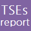

# Transmissible spongiform encephalopathies tool
The TSE data reporting tool is an open source Java client tool developed for the members of the Scientific Network for Zoonoses monitoring. The tool allows countries to submit and edit their data and automatically upload them into the EFSA Data Collection Framework (DCF) as XML data files.

    

# Dependencies
The project needs the following projects to work properly:
* https://github.com/openefsa/Dcf-webservice-framework
* https://github.com/openefsa/EFSA-RCL
* https://github.com/openefsa/email-generator
* https://github.com/openefsa/http-manager
* https://github.com/openefsa/http-manager-gui
* https://github.com/openefsa/java-exception-to-string
* https://github.com/openefsa/Progress-bar
* https://github.com/openefsa/sql-script-executor
* https://github.com/openefsa/version-manager
* https://github.com/openefsa/java-swt-window-size-save-and-restore
* https://github.com/openefsa/zip-manager
